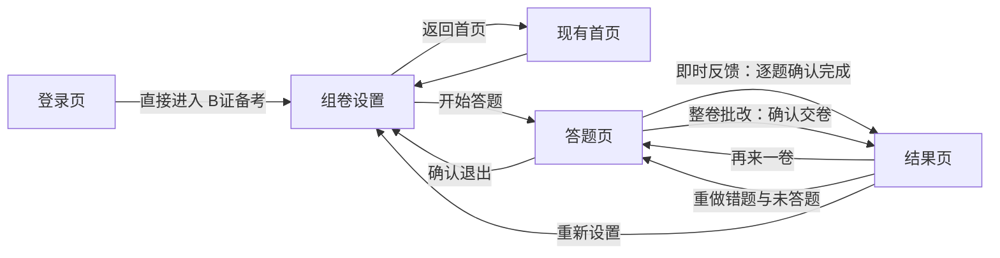

# PRD：B 证备考系统 MVP

## 1. 文档状态

- 状态：评审稿
- 目标用户：使用 B 证题库进行考前练习的学员
- 发布形态：独立静态 HTML 页面，由现有 Netlify 站点直接托管
- 题库来源：`B证题库复训.docx`

## 2. 背景与目标

现有站点缺少针对固定题库的组卷、练习和批改能力。本期需要基于附件题库快速上线一个可用的备考系统，让用户自行配置各题型数量后随机练习，并支持即时核对答案或整卷统一批改。

### 2.1 MVP 目标

1. 支持判断题、单选题、多选题三种题型。
2. 用户开始前可分别指定三种题型的抽题数量。
3. 每次按题型从题库中无放回随机抽题，即同一份试卷中已抽中的题目不会再次被抽中；重新组卷时可以再次抽到该题。
4. 支持“即时反馈”和“整卷批改”两种互斥答题模式，开始答题后不可切换。
5. 整卷提交后展示成绩、答题统计和每题对错结果。
6. 从现有首页可进入备考系统，并可通过 Netlify 快速部署。

### 2.2 成功标准

1. 用户可在不登录、不安装客户端的情况下完成一次组卷和答题。
2. 各题型库存上限从题库 JSON 动态统计；请求数量超过库存时阻止开始并提示用户修正，不溢出。
3. 所有抽取题目的选项和正确答案均与源题库一致。
4. 即时反馈模式下，确认一题后能看到正确答案和本题结果。
5. 整卷批改模式下，交卷前不泄露答案，交卷后可看到总成绩及逐题结果。

## 3. 题库现状与数据约束

经附件抽样与结构检查，题库使用 Word 表格保存，字段包括：序号、类型、题目、选项 1 至选项 5。正确选项通过 Word 中的红色字体或红色高亮标记。

附件中实际识别到的题型数量如下：

| 题型 | 题量 | 作答控件 | 正确答案数量 |
| --- | ---: | --- | --- |
| 单选题 | 400 | 单选框 | 1 个 |
| 多选题 | 200 | 复选框 | 2 个或以上 |
| 判断题 | 400 | “正确 / 错误”单选 | 1 个 |
| 合计 | 1000 | - | - |

说明：源文档题号并非从 1 到 1000 连续编号，系统应保留源题号作为题目 ID，不依赖题号连续性进行抽题或计分。

实施校验发现源文档有 16 道判断题答案标记异常：15 道未标记答案，1 道“正确 / 错误”同时标红。MVP 不猜测答案，这 16 道题不进入可用题库，并输出到 `docs/exam-question-bank-rejected-v1.json` 供源数据修正。首版可用库存为单选题 400、多选题 200、判断题 384，共 984 道；页面仍按 JSON 实际内容动态展示上限。

### 3.1 MVP 数据方案

1. 上线前将 DOCX 一次性转换为静态 JSON，页面运行时不解析 Word 文件。
2. 每道题至少包含以下字段：

```json
{
  "id": "source-1",
  "sourceNumber": 1,
  "type": "single",
  "question": "题干",
  "options": [
    { "id": "A", "text": "选项内容" }
  ],
  "answers": ["C"]
}
```

3. 判断题统一转换为两个选项：`正确`、`错误`。
4. 空白选项不写入 JSON，也不在页面显示。
5. 转换后必须自动校验：题目 ID 唯一、题型合法、题干非空、选项非空、答案存在于选项中、单选/判断仅一个答案、多选至少两个答案；不合法题目进入异常报告，不得进入页面题库。
6. MVP 不提供浏览器内上传或编辑题库能力；更新题库时重新生成静态 JSON 并部署。
7. 页面加载 JSON 后按 `type` 分组并读取各组数组的 `length`，动态得到单选题、多选题、判断题库存，不在页面逻辑中写死 400、200、400。
8. 题库预计极少更新，生产环境允许浏览器长期缓存；题库文件使用版本号或内容哈希命名，并配置长期缓存。需要更新时发布新文件名，确保用户不会继续读取旧题库。

## 4. MVP 范围（P0）

### 4.1 首页入口

1. 在现有 `index.html` 的导航按钮区新增“B证备考”入口。
2. 点击后进入独立备考页面。
3. 备考页面提供“返回首页”操作。
4. 在现有 `login.html` 增加“直接进入 B证备考”入口，未登录或登录已过期的用户点击后直接进入独立备考页面。
5. 从登录页进入 B证备考不校验、不创建或更新登录状态；首页及其他受保护功能继续沿用现有登录校验。

### 4.2 组卷设置

开始答题前展示：

1. 单选题数量输入框，默认值 5，并展示从 JSON 动态得到的库存上限。
2. 多选题数量输入框，默认值 5，并展示从 JSON 动态得到的库存上限。
3. 判断题数量输入框，默认值 5，并展示从 JSON 动态得到的库存上限。
4. 答题模式选择：
   - 即时反馈：每题确认后立即显示本题结果与正确答案。
   - 整卷批改：交卷前不显示正确答案，交卷后统一批改。
5. 各题型单题分值输入框，默认单选题 1 分、多选题 2 分、判断题 1 分，用户可修改。
6. “开始答题”按钮。

数量规则：

1. 仅接受非负整数，小数、负数和非数字输入需提示并阻止开始。
2. 单个题型可填 0，但三种题型合计必须大于 0。
3. 请求数量小于等于库存时，按请求数量抽取。
4. 请求数量超过动态库存时，对应输入框显示错误状态和“最多可选 N 题”，并阻止开始，直到用户将数量修正到合法范围；系统不得静默截断或自动改值。
5. 抽题在各题型内无放回进行，同一份试卷不得出现重复题目。“无放回”仅约束当前试卷，不影响下一次重新组卷。
6. 最终试卷将三种题型抽取结果再次随机混排，不固定按题型分组。

分值规则：

1. 三种题型分别设置单题分值，相同题型内每题分值相同。
2. 分值仅接受大于 0 的整数；空值、小数、0、负数或非数字均提示并阻止开始。
3. 多选题默认分值高于单选题和判断题，但用户可以修改为其他合法分值。
4. “再来一卷”时保留本次题量、答题模式和分值配置；“重新设置”时返回可编辑状态。

### 4.3 答题页

1. 默认每次显示一道题，降低移动端长页面操作成本。
2. 顶部固定展示当前进度，例如“第 8 / 50 题”和已答数量。
3. 展示题型标签、源题号、题干和全部有效选项。
4. 单选题、判断题选择一个答案；多选题可选择多个答案。
5. 支持“上一题”“下一题”，用户返回后保留已选答案。
6. 多选题必须点击“确认本题”后才算完成，避免勾选第一个选项时提前判题。
7. 单选题和判断题也使用“确认本题”，保持三种题型交互一致。
8. 确认前允许修改选择；即时反馈模式确认后锁定本题答案，避免看答案后修改。
9. 整卷批改模式下，用户可在交卷前返回并修改任意题答案。
10. 提供“退出本次答题”，二次确认后返回组卷设置；MVP 不保存未完成试卷。

### 4.4 即时反馈模式

1. 用户未选择任何选项时，不允许确认本题。
2. 确认后立即标记“回答正确”或“回答错误”。
3. 正确选项使用明确的颜色和图标标识。
4. 用户选错的选项同时标记为错误。
5. 多选题必须与标准答案集合完全一致才算正确；少选、多选、错选均判错。
6. 显示反馈后，用户点击“下一题”继续。
7. 最后一题确认后进入与整卷批改共用的结果页，展示实际得分、总分、百分比、各题型统计和逐题结果汇总。

### 4.5 整卷批改模式

1. 答题过程中不显示正确答案和对错状态。
2. 用户可随时点击“交卷”。
3. 存在未答题时，弹窗提示未答数量，用户可选择继续答题或确认交卷。
4. 确认交卷后锁定全部答案并统一批改。
5. 未答题按错误计入成绩。
6. 交卷后进入结果页，用户可回看全部题目或仅查看错题与未答题。
7. 错题题目区域使用红色边框或浅红背景高亮，用户选错的选项标红，并同时显示“回答错误”文字；正确答案仍需明确标出。

### 4.6 成绩与结果页

1. 每题分值取自组卷时对应题型的分值配置；答对获得该题全部分值，答错或未答得 0 分，不设部分得分或倒扣分。
2. 试卷总分计算：`单选题数 × 单选题分值 + 多选题数 × 多选题分值 + 判断题数 × 判断题分值`。
3. 百分比成绩计算：`实际得分 / 试卷总分 × 100%`，四舍五入取整数，仅用于辅助展示，不设置及格判断。
4. 展示：实际得分 / 试卷总分、百分比成绩、正确题数、错误题数、未答题数、总题数。
5. 按题型展示得分、满分、正确数和总数，例如“多选题：16 / 20 分，答对 8 / 10 题”。
6. 展示本次所有题目的答题详情：用户答案、正确答案、正确/错误/未答状态。
7. 错题和未答题的题目区域必须标红高亮，并有文字状态，不能只依赖颜色表达结果。
8. 支持仅筛选“错题与未答题”。
9. 支持“再来一卷”：保留当前数量、模式和分值配置，重新随机抽题。
10. 支持“重做错题”：仅使用本次结果中的错题和未答题组成新试卷，保持原顺序，清空旧答案，并保留当前批改模式和分值；本次全对时按钮禁用。
11. 支持“重新设置”：返回组卷设置页。
12. MVP 成绩和错题仅保留在当前页面会话中，刷新或关闭页面后不保存。

## 5. 页面与状态流转



## 6. 随机抽题与判分规则

### 6.1 抽题规则

对每种题型分别执行：

1. 读取该题型全部题目。
2. 读取该题型数组的 `length` 作为动态库存；请求数量大于库存时停止组卷并要求用户修正。
3. 使用 Fisher-Yates 洗牌或等价的均匀随机算法打乱副本。
4. 截取用户请求数量，不修改原题库数组。
5. 合并三种题型结果后再次洗牌，得到本次试卷。

### 6.2 判分规则

1. 单选题、判断题：用户答案与唯一标准答案相同即正确。
2. 多选题：先去重并排序，用户答案集合与标准答案集合完全相同即正确。
3. 多选题不设部分得分，少选、多选、错选均得 0 分。
4. 未作答：答案为空，记为未答且不得分。
5. 答对时获得该题型配置的完整单题分值；成绩只由本次抽取题目计算，不受源题号和题型库存影响。

## 7. 非功能要求

1. 兼容当前主流桌面 Chrome、Safari、Edge，以及华为手机浏览器和 iPhone Safari。
2. 必须适配华为手机与 iPhone 常见屏幕宽度和安全区域；在 320px 至 430px CSS 视口宽度下不得横向滚动，长题干与长选项应自动换行，底部操作区不得被 Safari 工具栏或安全区域遮挡。
3. 状态标识不能只依赖颜色，需同时包含文字或图标。
4. 按钮和选项应支持键盘聚焦，表单控件应有关联标签。
5. 题库 JSON 加载失败时展示明确错误和重试入口，不进入空白试卷。
6. 全部功能在浏览器本地运行；MVP 不新增后端服务、数据库或 Netlify Function。
7. 页面资源使用相对路径，确保 Netlify 根目录静态发布后可直接访问。
8. 题库 JSON 使用浏览器 HTTP 缓存降低重复下载；采用版本化或内容哈希文件名并设置长期缓存，发布新题库时通过新 URL 完成缓存失效。
9. 缓存命中时直接使用缓存题库；首次加载或缓存不可用时正常从网络获取。MVP 不承诺完全离线可用。

## 8. 非目标（本期不做）

1. 用户注册、登录和多用户权限。
2. 云端成绩保存、跨设备同步、排行榜。
3. 错题本持久化、收藏题目、学习曲线和历史统计。
4. 限时考试、倒计时、及格线或正式考试规则模拟。
5. 按知识点、章节、难度筛选题目。
6. 题目解析、知识点讲解和外部资料链接。
7. 在线上传、编辑、审核或导出题库。
8. 服务端防作弊、答案加密或正式认证考试用途。
9. PWA 离线安装和消息提醒。

## 9. 异常与边界处理

1. 三种数量均为 0：阻止开始并提示至少选择 1 道题。
2. 输入超过动态库存：字段标红并显示“最多可选 N 题”，阻止开始，要求用户修正。
3. 输入为空：按 0 处理，并在失焦后显示 0。
4. 输入小数、负数或非数字：标记对应字段错误，不开始组卷。
5. 题库某题数据不合法：构建/测试阶段直接失败，不允许静默进入生产题库。
6. 页面运行时题库文件加载失败：展示加载失败提示和重试按钮。
7. 交卷时有未答题：显示未答数量并要求二次确认。
8. 刷新答题页：MVP 视为重新开始，回到组卷设置页。

## 10. 验收标准

| 模块 | 验收场景 | 预期结果 |
| --- | --- | --- |
| 题库 | 加载附件转换后的题库 | 识别源题单选 400、多选 200、判断 400；隔离 16 道答案异常判断题，可用题库共 984 道且答案均合法 |
| 动态库存 | 加载题库后查看三种题型数量上限 | 上限分别来自 JSON 中对应题型数组的 `length`，页面逻辑无写死数量 |
| 首页入口 | 点击“B证备考” | 进入独立备考页面，可返回首页 |
| 未登录入口 | 清除或使登录状态过期，在登录页点击“直接进入 B证备考” | 不要求输入账号密码，直接进入备考页面，且不创建或更新登录状态 |
| 登录保护回归 | 未登录时访问现有首页或其他受保护功能 | 仍按现有规则跳转登录页，不因 B证公开入口而放开 |
| 数量配置 | 输入单选 10、多选 5、判断 5 | 生成 20 道且各题型数量准确的试卷 |
| 防溢出 | 任一题型输入大于其动态库存的数量 | 输入框标红并提示实际可用上限，阻止开始，修正后可正常组卷 |
| 空试卷保护 | 三种题型均输入 0 | 阻止开始并提示至少选择 1 题 |
| 随机性 | 使用相同配置连续开始多次 | 题目或顺序通常不同，单卷内无重复题 |
| 即时反馈 | 确认任一道题 | 立即显示本题对错和正确答案，答案被锁定 |
| 多选判分 | 分别测试全对、少选、多选、错选 | 仅答案集合完全一致时判为正确 |
| 整卷批改 | 作答后交卷 | 交卷前不泄露答案，交卷后显示成绩和逐题答案 |
| 错题回看 | 整卷提交后查看答错题目 | 错题区域和错误选项标红高亮，同时展示正确答案与文字状态 |
| 未答交卷 | 留题未答并点击交卷 | 提示未答数量；确认后未答题按错误计分 |
| 自定义分值 | 设置单选 1 分、多选 2 分、判断 1 分后交卷 | 按题型分值计算实际得分和总分，多选少选、多选、错选均不得分 |
| 结果筛选 | 开启“仅看错题与未答” | 只展示错误题和未答题 |
| 错题重做 | 点击“重做错题”并完成新试卷 | 仅包含上一轮错题与未答题，旧答案已清空，沿用原批改模式和分值 |
| 全部答对 | 结果页无错题和未答题 | “重做错题”按钮禁用 |
| 再来一卷 | 点击“再来一卷” | 保留数量和模式，重新随机生成试卷 |
| 华为手机适配 | 在华为手机浏览器完成设置、答题、交卷和错题回看 | 无内容遮挡或横向滚动，操作可完成 |
| iPhone 适配 | 在 iPhone Safari 完成设置、答题、交卷和错题回看 | 内容不被安全区域或浏览器工具栏遮挡，操作可完成 |
| 题库缓存 | 首次加载后刷新或再次进入页面 | 复用浏览器缓存；题库文件版本变化后能加载新版本 |
| 部署 | 通过现有 Netlify 配置发布 | 页面及题库 JSON 均可通过静态 URL 正常访问 |

## 11. 建议实施顺序（评审通过后，TDD）

1. Red：先写题库转换校验测试，证明三类题量、答案标记和字段约束可被正确识别。
2. Green：实现 DOCX 到静态 JSON 的一次性转换，并生成首版题库。
3. Red：补充动态库存超限拦截、无重复、多选全匹配判分、自定义分值和成绩计算的单元测试。
4. Green：实现纯函数形式的组卷与判分逻辑。
5. Red：补充页面结构、首页入口和关键交互的回归测试。
6. Green：实现独立 HTML/CSS/JS 页面及首页跳转。
7. 回归：运行自动化测试，并在华为手机尺寸和 iPhone Safari 环境中验证完整流程。

## 12. 风险与应对

1. **答案视觉标记解析风险**：源 Word 使用红色字体/高亮标记答案，转换时需同时兼容两种标记，并对 1000 道题执行完整性校验；答案缺失或冲突的题目必须隔离并写入异常报告。
2. **Word 表格合并单元格风险**：题干可能跨行、单元格可能纵向合并，转换器需按逻辑题目合并文本，不能按单个 XML 行直接切题。
3. **源题内容质量风险**：附件可能存在断行、空格或错别字；MVP 保持原文，不在开发过程中擅自改题。
4. **答案暴露风险**：静态 JSON 可被技术用户查看，因此系统仅适用于备考练习，不用于正式或防作弊考试。
5. **大题库首屏性能风险**：1000 道纯文本题预计可由静态 JSON 承载；页面只渲染当前题，避免一次性创建全部题目节点。
6. **长期缓存更新风险**：题库 JSON 使用长期缓存后，原 URL 内容更新可能无法及时生效；必须通过版本号或内容哈希生成新文件名，不覆盖旧 URL。

## 13. 已确认决策

1. “即时反馈”和“整卷批改”为两个互斥模式，开始答题后不可切换。
2. 页面支持分别设置三种题型的单题分值，默认单选题 1 分、多选题 2 分、判断题 1 分。
3. 多选题必须与标准答案集合完全匹配；少选、多选、错选均不得分。
4. 默认组卷数量为单选题 5、多选题 5、判断题 5，用户可修改。
5. MVP 不设置及格分数，不显示“通过 / 未通过”。
6. 页面名称使用“B证备考”。
7. MVP 不持久化成绩和错题；刷新或关闭页面后记录清空。
8. B证备考无需登录；登录页提供公开入口，但不改变首页及其他功能的登录保护。