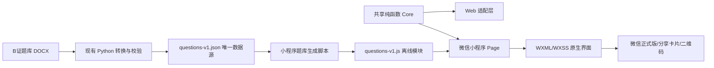

# B 证备考微信小程序技术方案与可行性分析

## 1. 结论

**技术可行，建议实施。** 推荐将现有 B 证备考页迁移为原生微信小程序，题库随代码包离线发布，不接后端、不使用云开发、不要求微信登录。该方案可以在微信内直接打开，并通过小程序卡片或二维码分享给朋友。

现有题库文件为 408,728 字节，现有题库、核心逻辑、页面逻辑和样式合计约 425KB。即使加上 WXML、WXSS、图标和发布配置，预计仍明显低于微信小程序单个主包/分包 2MB 的官方上限，因此 MVP 不需要服务器、域名、数据库或对象存储。

“免费发布”在技术架构上成立：个人主体账号、开发者工具、本地题库和正式版分享均不需要为本项目购买服务器、域名或云资源。但能否以个人主体正式发布，最终取决于提交时微信平台对服务类目、题库内容和主体资质的审核，不能在开发前承诺必然过审。

## 2. 目标与范围

### 2.1 目标

1. 在微信中直接打开 B 证备考，无需跳转浏览器。
2. 保留 Web MVP 已有能力：5/5/5 默认组卷、随机抽题、单选/多选/判断、即时反馈、整卷批改、成绩汇总、错题与未答题重做。
3. 无账号、无支付、无广告、无用户个人信息收集。
4. 正式发布后可通过微信好友/群聊小程序卡片或二维码分享。
5. 运行期不依赖 Netlify 或其他网络服务，服务器成本为 0。

### 2.2 MVP 不做

1. 不同步 Web 与小程序答题记录。
2. 不提供云端错题本、排行榜或跨设备记录。
3. 不接微信登录、手机号、订阅消息或支付。
4. 不远程更新题库；题库更新随新版本重新提审发布。
5. 不在小程序中使用 `web-view` 打开现有站点。

## 3. 现状评估

### 3.1 可复用内容

| 模块 | 复用程度 | 处理方式 |
| --- | --- | --- |
| 题库转换器与校验 | 高 | 继续以现有 JSON 为唯一题库源，增加小程序题库模块生成步骤 |
| `exam-prep/core.js` | 高 | 抽取为环境无关纯函数模块，Web 与小程序共用同一套组卷、校验、判分和重做逻辑 |
| 现有 Node/Python 测试 | 高 | 保留并扩展为双端共享逻辑回归测试 |
| `exam-prep/app.js` | 低 | 依赖 DOM、`document`、`window` 和事件监听，需改写为小程序 `Page` 状态与事件方法 |
| HTML/CSS | 中低 | 视觉信息架构可复用，标签和 CSS 需改写为 WXML/WXSS/rpx |

### 3.2 不能直接复用网页的原因

微信小程序不是浏览器 DOM 环境，不能直接运行 `document.getElementById`、`window.confirm`、`replaceChildren` 等现有代码。对应迁移关系如下：

| Web | 微信小程序 |
| --- | --- |
| HTML | WXML |
| CSS | WXSS |
| DOM 更新 | `setData` |
| `window.confirm` | `wx.showModal` |
| `window.scrollTo` | `wx.pageScrollTo` |
| 点击监听器 | WXML `bindtap` + Page 方法 |
| 页面分享链接 | `onShareAppMessage` 小程序卡片 |

## 4. 方案比较

| 方案 | 开发量 | 免费运行 | 审核/运行风险 | 结论 |
| --- | ---: | ---: | --- | --- |
| 原生小程序 + 离线题库 | 中 | 是 | 主要是类目和内容审核 | **推荐** |
| `web-view` 包装现有网页 | 低 | 不稳定 | 依赖业务域名、网页备案和平台能力；网络不可用时失败 | 不推荐 |
| Taro/uni-app 跨端重写 | 中高 | 是 | 增加框架、构建和调试复杂度，本期没有多端新增需求 | 不推荐 |
| 仅发布体验版 | 低 | 是 | 只适合指定体验成员，不适合长期分享给普通朋友 | 仅用于测试 |

选择原生方案的核心原因：功能简单、目标平台唯一、题库足够小。引入跨端框架不会减少关键迁移工作，反而增加包体与维护成本。

## 5. 推荐架构



### 5.1 建议目录

```text
wechat-miniprogram/
├── app.js
├── app.json
├── app.wxss
├── project.config.example.json
├── sitemap.json
├── pages/
│   └── exam/
│       ├── exam.js
│       ├── exam.json
│       ├── exam.wxml
│       └── exam.wxss
├── shared/
│   └── exam-prep-core.js
└── data/
    └── questions-v1.js
scripts/
└── generate_exam_miniprogram_bank.js
tests/
├── test-exam-prep-core.js
├── test-exam-prep-miniprogram-bank.js
└── test-exam-prep-miniprogram-page.js
```

AppID 是公开项目标识，可随 `project.config.json` 提交以支持开发者工具导入和自动上传；开发者私有配置、密钥和本机状态不得提交。

### 5.2 页面状态设计

MVP 使用一个 `pages/exam/exam` 页面，通过 `view = setup | quiz | results` 切换区域，避免页面跳转时序列化整份试卷。

完整 984 题保存在 Page 实例的非响应式字段中，不放入 `data`。`data` 只保存当前题、进度、选中答案、设置项和结果摘要，避免 `setData` 传输大对象导致卡顿。

```text
非响应式状态：questionBank、exam、responses、confirmed、result
响应式 data：view、currentQuestion、currentIndex、answeredCount、settings、feedback、resultView
```

### 5.3 题库打包

小程序不在运行时请求 Netlify。构建脚本读取现有 `exam-prep/questions-v1.json`，校验后生成可被 `require()` 的 `questions-v1.js`。

优点：

1. 首次打开即可使用，不受网络和域名影响。
2. 不需要配置 request 合法域名。
3. 不需要购买服务器、域名或 SSL 证书。
4. 审核版本与实际题库内容完全一致，不存在远程切换内容风险。

代价：题库每次更新都需要上传新代码并重新提交审核。对于低频更新题库，这是可接受的。

### 5.4 分享

在页面定义 `onShareAppMessage`，允许用户通过右上角菜单或明确的“分享给朋友”按钮发送小程序卡片。分享只打开备考首页，不携带成绩、答案或个人数据，也不以分享作为解锁功能的条件。

## 6. 免费发布路径

### 6.1 推荐路径：个人主体正式版

1. 使用未注册过公众平台的邮箱申请个人主体小程序，取得 AppID。
2. 在微信公众平台确认个人主体当前可选服务类目。
3. 完成原生 MVP，在微信开发者工具中预览和真机测试。
4. 在小程序后台完成备案。个人备案需要有效身份证件、手机号、人脸核验和工信部短信核验。
5. 上传代码，选择与实际功能一致的服务类目，提交平台审核。
6. 审核通过后发布正式版。
7. 通过小程序卡片或二维码分享给朋友；朋友无需成为开发者或体验成员。

官方备案指引给出的时效是：平台初审约 1-2 个工作日，省级通信管理局审核约 1-20 个工作日，实际时间以平台为准。代码审核时长没有在本方案中作保证。

### 6.2 费用边界

| 项目 | 推荐方案预算 | 说明 |
| --- | ---: | --- |
| 微信开发者工具 | 0 元 | 官方工具 |
| 后端/云开发 | 0 元 | 不使用 |
| 服务器/对象存储 | 0 元 | 题库随包 |
| 域名/SSL | 0 元 | 无网络请求 |
| 数据库 | 0 元 | 不使用 |
| 微信支付 | 0 元 | 不接入 |
| 平台认证 | 0 元预算 | 个人免费 MVP 不依赖认证能力；若平台要求改为非个人主体，则需重新评估主体、资质与认证费用 |
| 备案 | 0 元预算 | 需本人提交材料和核验，按后台实际要求执行 |

这里的“免费”指不购买技术基础设施和付费能力，不包含开发投入，也不保证未来平台政策不调整。

### 6.3 体验版与正式版的区别

体验版适合开发阶段本人和少量已配置的体验成员测试。要让普通朋友长期从微信卡片或二维码直接使用，应完成备案、审核并发布正式版。

## 7. 服务类目与审核可行性

### 7.1 初步判断

个人主体开放类目中有“教育服务/教育信息展示”和“工具/信息查询”等类目，但平台要求服务内容、名称、简介和实际类目一致。B 证题库具有交互式练习和判分能力，是否仍属于个人主体可发布范围，需以提交时后台类目说明及审核结果为准。

**不能为了过审把真实的备考练习功能错误申报为纯信息查询。** 推荐在正式开发前先登录小程序后台确认个人主体可选类目及所需材料；无法确认时通过平台客服咨询并保存答复。

### 7.2 降低审核风险的产品边界

1. 定位为“个人学习练习工具”，不提供收费培训、课程销售、直播、视频课程、考试报名或证书查询。
2. 不使用“官方”“指定”“保过”“押题”“考试原题”等可能误导用户的名称和文案。
3. 页面明确声明“非官方练习工具，结果不代表正式考试成绩或资格认定”。
4. 提供开发者有效联系方式和题目纠错入口。
5. 不收集用户信息，不要求授权头像、昵称、手机号或位置。
6. 不提供 UGC、评论、聊天和用户上传，避免内容安全与社交类目复杂度。
7. 不接广告或支付，避免交易、虚拟支付和保证金要求。

### 7.3 题库版权是发布前置条件

现有题库来自 DOCX 文件。正式向朋友发布前，必须确认题库来源及传播授权。如果题库由第三方培训机构、出版社、题库平台或考试机构制作，整库复制可能存在版权风险。微信运营规范明确禁止未经授权传播第三方文字及其他版权内容。

发布前至少满足以下一种条件：

1. 题库为本人原创；
2. 题库属于明确允许再传播的公开资料，并保留许可依据；
3. 已取得权利方书面授权；
4. 替换为自行整理、具有合法来源记录的题目。

如果无法确认授权，技术实现仍可供本人本地预览，但不建议提交正式发布或分享给朋友。

## 8. 实施方案（TDD First）

### 阶段 0：发布门槛确认

1. 用户创建或确认个人主体小程序账号和 AppID。
2. 在后台确认可选类目及材料要求。
3. 确认题库传播授权。
4. 确认小程序名称、简介和非官方声明。

门槛 2 或 3 不满足时，暂停正式发布，但可继续制作仅本人使用的开发/体验版。

### 阶段 1：共享核心与题库

1. RED：增加同一组样例在 Web 与小程序模块中组卷、判分结果一致的测试。
2. GREEN：抽取环境无关核心模块，Web 和小程序共同引用。
3. RED：增加小程序题库模块题量、答案合法性、ID 唯一性和体积测试。
4. GREEN：实现 JSON 到小程序 JS 模块的生成脚本。

### 阶段 2：小程序页面

1. RED：增加组卷设置、默认 5/5/5、模式、分值和按钮结构契约测试。
2. GREEN：实现 WXML/WXSS 设置视图。
3. RED：增加单选、多选、判断、即时反馈和整卷批改 Page 状态测试。
4. GREEN：实现答题事件与状态切换。
5. RED：增加成绩汇总、筛选、错题/未答题重做测试。
6. GREEN：实现结果视图和重做流程。
7. RED：增加分享路径不得携带答题结果的测试。
8. GREEN：实现 `onShareAppMessage`。

### 阶段 3：微信环境验收

1. Node/Python 自动化全部通过。
2. 微信开发者工具编译无错误或警告。
3. 使用开发者工具 CLI 输出代码包大小，主包低于 2MB。
4. iPhone 和 Android 微信真机完成设置、答题、交卷、重做和分享。
5. 断网后重新打开已加载的小程序，核心练习仍可用。
6. 上传体验版，邀请指定体验成员回归。
7. 备案完成后提交审核，审核通过再发布。

## 9. 验收标准

| 模块 | 验收点 | 预期结果 |
| --- | --- | --- |
| 启动 | 微信内首次打开 | 无登录、无授权弹窗，直接看到组卷设置 |
| 题库 | 加载题库 | 可用题量为单选 400、多选 200、判断 384 |
| 组卷 | 默认设置 | 默认 5/5/5，分值 1/2/1 |
| 判分 | 两种模式 | 与 Web 版本规则一致 |
| 重做 | 错题与未答题 | 清空答案并保留模式和分值 |
| 离线 | 无网络练习 | 不依赖远程接口，核心流程可完成 |
| 性能 | 页面切换与选题 | 不把 984 题写入 `data`，操作无明显卡顿 |
| 分享 | 分享给朋友 | 打开小程序备考首页，不泄露成绩或答案 |
| 隐私 | 使用完整流程 | 不申请或采集用户个人信息 |
| 包体 | CLI 预览/上传报告 | 主包小于 2MB |
| 发布 | 正式版 | 完成备案与审核后，普通微信好友可通过卡片或二维码使用 |

## 10. 风险与应对

| 风险 | 等级 | 应对 |
| --- | --- | --- |
| 个人主体类目不接受交互式备考 | 高 | 开发前核对后台类目并咨询平台；不错误申报；必要时改用具备合适资质的非个人主体 |
| 题库无传播授权 | 高 | 正式开发发布前完成来源审查和书面授权，否则只做本人本地体验 |
| 名称被认为冒充官方 | 中高 | 使用自有名称，增加非官方声明，不使用官方机构 Logo 和误导性文案 |
| 题库更新需重新审核 | 中 | 保持版本化生成和发布清单；低频更新时成本可控 |
| Web 与小程序规则漂移 | 中 | 共用纯函数核心和同一题库源，双端运行相同回归用例 |
| 小程序政策变化 | 中 | 每次发布前复核动态类目和运营规范，以后台提交时规则为准 |

## 11. 工作量估算

在 AppID、类目和题库授权已确认的前提下：

| 工作项 | 估算 |
| --- | ---: |
| 项目骨架、共享 Core、题库生成 | 0.5-1 人日 |
| 设置、答题、结果和重做页面 | 1.5-2 人日 |
| 自动化、开发者工具与真机回归 | 1-1.5 人日 |
| 发布材料与审核整改预留 | 0.5-1 人日，不含平台等待 |
| 合计 | 3.5-5.5 人日 |

平台备案和审核等待不计入开发人日。备案官方时间范围可能达到 1-20 个工作日。

## 12. 推荐决策

建议按以下顺序推进：

1. **先确认题库版权。** 这是能否向朋友发布的硬门槛。
2. **注册个人主体小程序并核对类目。** 以后台当前可选项和平台答复为准。
3. 两项都通过后，按本文 TDD 阶段实施原生离线 MVP。
4. 先发布体验版完成本人和朋友回归，再走备案、审核和正式发布。
5. 若个人主体类目被拒，不继续反复换类目试审；改为仅本人体验版，或评估具有合适资质的非个人主体。

## 13. 官方依据

以下资料于 2026-08-27 查阅，平台规则为动态文档，正式提交时需再次核对：

1. [微信小程序起步/申请账号](https://developers.weixin.qq.com/miniprogram/dev/framework/quickstart/getstart.html)
2. [小程序分包加载与包大小限制](https://developers.weixin.qq.com/miniprogram/dev/framework/subpackages.html)
3. [小程序网络与服务器域名](https://developers.weixin.qq.com/miniprogram/dev/framework/ability/network.html)
4. [个人主体开放服务类目](https://developers.weixin.qq.com/miniprogram/product/material/#个人主体小程序开放的服务类目)
5. [小程序备案操作指引](https://developers.weixin.qq.com/miniprogram/product/record_guidelines.html)
6. [微信小程序平台运营规范](https://developers.weixin.qq.com/miniprogram/product/)
7. [小程序转发能力](https://developers.weixin.qq.com/miniprogram/dev/framework/open-ability/share.html)
8. [Page.onShareAppMessage](https://developers.weixin.qq.com/miniprogram/dev/reference/api/Page.html#onShareAppMessage-Object-object)
9. [微信开发者工具 CLI](https://developers.weixin.qq.com/miniprogram/dev/devtools/cli.html)
